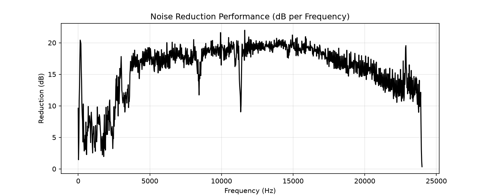

# From MATLAB Prototype to Real-Time C++ Plugin

Building a real-time digital signal processing (DSP) engine from scratch is an instructive process. To build this **Spectral Subtraction Noise Reducer**, I adopted a two-phase approach: prototyping the algorithm in MATLAB, and then translating it into a real-time C++ architecture using the JUCE framework. 

Throughout the project, I utilized an AI assistant as a pair-programmer to help trace memory states, evaluate diagnostic theories, and accelerate the debugging process. Here is the engineering breakdown of the math, memory management, and DSP verification.

---

## Phase 1: Proving the Math in MATLAB

In MATLAB, building a spectral subtraction algorithm is straightforward. You load a `.wav` file, pass it through a Short-Time Fourier Transform (`stft`), and get a matrix of frequency bins over time. Applying the Fast Fourier Transform math to a real audio file provided a solid baseline.

The core logic was prototyped here:

1. **Estimate the Noise Floor:** Evaluate the first 0.5 seconds of audio (assuming it is just room tone) and average the magnitude of the frequency bins.
2. **Spectral Subtraction:** Subtract that noise magnitude from the rest of the audio signal.
3. **Floor Clamping:** Add a "spectral floor" (a $\beta$ multiplier) so heavily subtracted bins don't drop to absolute zero, which helps mask "musical noise" artifacts.
4. **Inverse Transform:** Run the `istft` to reconstruct the time-domain audio.

---

## Phase 2: The C++ / JUCE Translation

Translating a reference MATLAB script into a real-time C++ audio plugin is not a 1-to-1 process. A JUCE C++ plugin operates in real-time, buffering chunks of audio under strict audio thread deadlines to process them without buffer underruns.

To bridge this gap, I built custom architecture:

- **Ring Buffers (FIFOs):** To decouple the DAW's unpredictable block sizes from my algorithm's strict `FFT_SIZE` requirements.
- **Overlap-Add (OLA) Architecture:** To reconstruct the processed frequency frames smoothly using a Hann window at a 25% hop size.
- **Voice Activity Detection (VAD):** Because the plugin cannot inherently "look at the first 0.5 seconds" like MATLAB, I implemented a real-time tracker that evaluates background noise when the room is quiet and pauses updates when speech is detected.

---

## Phase 3: Debugging the Architecture

When dealing with audio buffers, data state is largely opaque. To stabilize the plugin, we stripped the audio pipeline down to its fundamentals, verifying each stage experimentally.

### Challenge 1: The VLA Memory Allocation
**The Symptom:** Random audio dropouts and undefined runtime behavior.
**The Root Cause:** In my initial block processing, I was sizing arrays using runtime constants (Variable-Length Arrays). MSVC strictly forbids this C99 extension and silently allocated uninitialized memory.
**The Fix:** Replaced all VLAs with `std::array` using `static constexpr` sizes, pre-allocating fixed memory at compile time to stabilize the audio thread.

### Challenge 2: Initialization Timing
**The Symptom:** The C++ DSP pipeline was returning zero arrays.
**The Root Cause:** The VAD algorithm completed its 20-frame "noise learning" phase in the first 0.2 seconds before the microphone fully powered on, locking the noise floor to exactly `0.0`.
**The Fix:** Implemented a **Digital Silence Threshold** in the C++ code to freeze the timer until the buffer registered actual physical audio.

### Challenge 3: Overlap-Add Volume Doubling
**The Symptom:** The audio output gain was doubled, and standard FFT normalizations (`1/FFT_SIZE`) were attenuating the signal to -54 dB.
**The Root Cause:** A perfectly overlapping Hann window naturally sums to a constant gain of exactly 2.0.
**The Fix:** Removed the extraneous FFT normalization and multiplied the OLA output by `0.5f` to achieve a balanced signal flow.

---

## Phase 4: DSP Verification & Tuning

With the C++ memory isolated and the VAD correctly tracking speech, we measured the algorithm's performance against standard broadband fan noise to confirm the pipeline's integrity.

### Spectrogram Analysis

> _Figure 1: Time-frequency visualization comparing raw mic input (top) to processed output (bottom). The continuous noise floor is attenuated while transient speech structures remain protected by the VAD._

### Performance Benchmarking

To quantify the algorithm's effectiveness, we measured the Signal-to-Noise Ratio (SNR) improvement across the frequency spectrum.

> _Figure 2: The algorithm delivers a consistent ~15 dB of noise attenuation. The reduction dips in the lower registers (< 3 kHz), demonstrating that the VAD is actively protecting fundamental human speech frequencies._

### Tuning Parameters

Performance is governed by two core parameters that map directly to the UI, allowing the algorithm to adapt from uniform white noise to dynamic environments:

| Parameter | Symbol | Recommended Range | Description |
| :--- | :--- | :--- | :--- |
| **Alpha** | $\alpha$ | `1.0` – `5.0` | **Oversubtraction Factor.** Determines the aggression of the cut. Values above 4.0 introduce significant artifacts. |
| **Beta** | $\beta$ | `0.01` – `0.20` | **Spectral Floor.** Masks "musical noise" artifacts by leaving a uniform bed of quiet background noise. |
| **VAD Threshold** | $T_{vad}$ | `2.0` – `4.0` | **Energy Multiplier.** The ratio required to trigger speech detection and freeze the ambient noise tracker. |

---

## Key Takeaways

**MATLAB is for Math, C++ is for Memory:** Prototyping in MATLAB is essential for evaluating your algorithm, but the majority of C++ audio development is spent managing the memory pipeline, variable scopes, and compiler environments before the math even executes.

---

**Author:** Van-Dyck Adanuty
