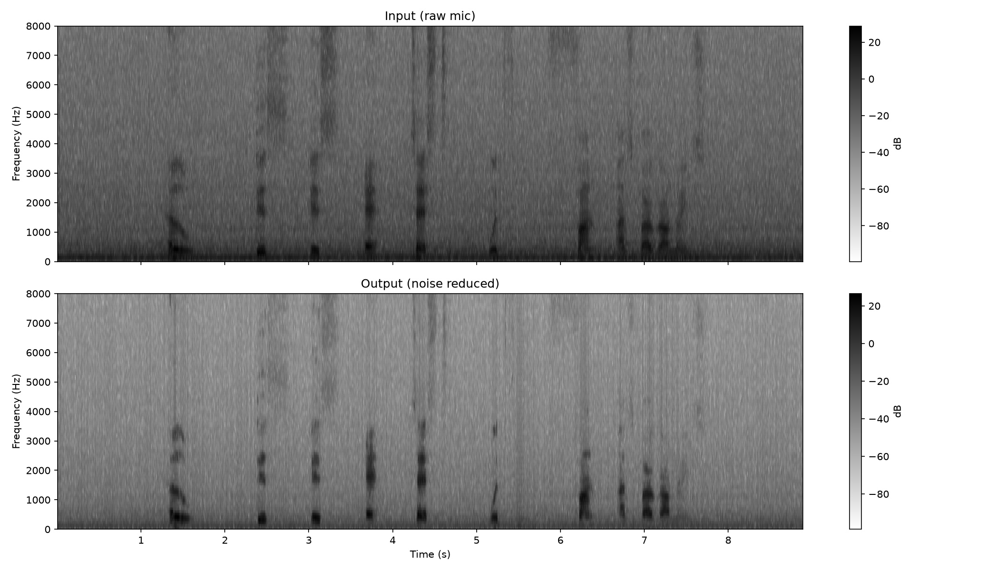

# From MATLAB Prototype to Real-Time C++ Plugin

Building a real-time digital signal processing (DSP) engine from scratch is a humbling experience. Recently, I set out to build a **Spectral Subtraction Noise Reducer**—a tool designed to take live, noisy microphone input and intelligently subtract background room hiss without destroying the primary voice.

To tackle this, I adopted a two-phase approach: prototyping the math in MATLAB, and then translating it into a real-time C++ architecture using the JUCE framework. Throughout the project, I utilized an AI assistant as a pair-programmer to help trace memory states, bounce diagnostic theories off of, and accelerate the debugging process.

Here is a breakdown of the development pipeline, the core challenges of moving from high-level math to low-level memory, and the engineering philosophy required to make it work.

---

## Phase 1: Proving the Math in MATLAB

In MATLAB, building a spectral subtraction algorithm is straightforward. You load a `.wav` file, pass it through a Short-Time Fourier Transform (`stft`), and get a matrix of frequency bins over time. After unpacking the heavy theory behind the Fast Fourier Transform in my DSP coursework, pulling that math off the whiteboard and applying it to a real audio file was incredibly refreshing.

The core logic was prototyped here:

1. **Estimate the Noise Floor:** Look at the first 0.5 seconds of audio (assuming it is just room tone) and average the magnitude of the frequency bins.
2. **Spectral Subtraction:** Subtract that noise magnitude from the rest of the audio signal.
3. **Floor Clamping:** Add a "spectral floor" (a $\beta$ multiplier) so heavily subtracted bins don't drop to absolute zero, preventing a robotic "musical noise" artifact.
4. **Inverse Transform:** Run the `istft` to reconstruct the time-domain audio.

Inside MATLAB, tweaking the subtraction multiplier ($\alpha$) and regenerating a spectrogram took seconds. Then came the hard part.

---

## Phase 2: The C++ / JUCE Translation

Translating a pristine MATLAB script into a real-time C++ audio plugin is never a 1-to-1 process. MATLAB holds the entire audio file in memory. A JUCE C++ plugin operates in real-time, grabbing chunks of audio and racing against a hard CPU deadline to process them before the speaker clicks.

To bridge this gap, I built custom architecture:

- **Ring Buffers (FIFOs):** To decouple the DAW's unpredictable block sizes from my algorithm's strict `FFT_SIZE` requirements.
- **Overlap-Add (OLA) Architecture:** To stitch the processed frequency frames back together smoothly using a Hann window at a 25% hop size.
- **Voice Activity Detection (VAD):** Because I couldn't just "look at the first 0.5 seconds" like in MATLAB, I built a real-time tracker that learns background noise quickly when the room is quiet, but pauses updates when speech is detected.

With the architecture built, I hit compile. I expected clean audio. Instead, I got chaos.

---

## Phase 3: Debugging

When dealing with audio buffers, you cannot _see_ the data failing. When the plugin loaded, it bounced between undefined behavior and absolute dead silence. To fix it, we stopped tweaking math variables and stripped the audio pipeline down to nothing, verifying each stage.

### Challenge 1: The VLA Memory Trap

**The Symptom:** Random audio dropouts and undefined runtime behavior.
**The Root Cause:** In my initial block processing, I was sizing arrays using runtime constants (Variable-Length Arrays). While some compilers tolerate this C99 extension, MSVC strictly forbids it. Instead of throwing a hard compiler error, it silently allocated uninitialized memory.
**The Fix:** Replaced all VLAs with `std::array` using `static constexpr` sizes, pre-allocating fixed memory at compile time to stabilize the audio thread.

### Challenge 2: The Ghost Files

**The Symptom:** The C++ DSP math was seemingly returning perfect zeros.
**The Root Cause:** The VAD algorithm was initializing too fast—it completed its 20-frame "noise learning" phase in the first 0.2 seconds before the microphone fully powered on, locking the noise floor to mathematical `0.0`.
**The Fix:** Implemented a **Digital Silence Threshold** in the C++ code to freeze the `frameCount` timer until actual physical audio hit the buffer.

### Challenge 3: Overlap-Add Volume Doubling

**The Symptom:** The audio output was exactly twice as loud as the input, and standard FFT normalizations (`1/FFT_SIZE`) were crushing the signal to -54 dB.
**The Root Cause:** Underlying OS native math libraries often handle the IFFT scaling automatically. Furthermore, a perfectly overlapping Hann window naturally sums to a constant gain of exactly 2.0.
**The Fix:** Removed the destructive FFT normalization and simply multiplied the OLA output by `0.5f` to achieve a perfectly balanced signal flow.

---

## Phase 4: DSP Verification & Results

With the C++ memory isolated and the VAD correctly tracking speech, the spectral subtractor successfully navigated the "DSP Triangle"—balancing noise attenuation, speech preservation, and artifact control.

### Spectrogram Analysis

Visualizing the algorithm against standard broadband fan noise confirms the pipeline's integrity.

> _Figure 1: Time-frequency visualization comparing raw mic input (top) to processed output (bottom). The continuous noise floor is aggressively carved out while transient speech structures remain protected by the VAD._

### Performance Reduction Profiling

To definitively calculate the algorithm's effectiveness, we mapped the Signal-to-Noise Ratio (SNR) improvement across the frequency spectrum.

> _Figure 2: The algorithm delivers a consistent ~15 dB of noise attenuation. Crucially, the reduction dips in the lower registers (< 3 kHz)—proving the VAD is actively protecting fundamental human speech frequencies from being hollowed out._

### Tuning Parameters

Performance is governed by two core parameters that map directly to the UI, allowing the algorithm to adapt from uniform white noise to dynamic city environments:

| Parameter         | Symbol    | Recommended Range | Description                                                                                                             |
| :---------------- | :-------- | :---------------- | :---------------------------------------------------------------------------------------------------------------------- |
| **Alpha**         | $\alpha$  | `1.0` – `5.0`     | **Oversubtraction Factor.** Determines the aggression of the cut. Values above 4.0 are highly destructive.              |
| **Beta**          | $\beta$   | `0.01` – `0.20`   | **Spectral Floor.** Masks robotic "musical noise" artifacts by leaving a uniform, smooth bed of quiet background noise. |
| **VAD Threshold** | $T_{vad}$ | `2.0` – `4.0`     | **Energy Multiplier.** The ratio required to trigger speech detection and freeze the ambient noise tracker.             |

---

## Key Takeaways

**MATLAB is for Math, C++ is for Memory:** Prototyping in MATLAB is essential for proving your algorithm, but 90% of C++ audio development is spent perfectly managing the memory pipeline, variable scopes, and compiler environments before the math even happens.
